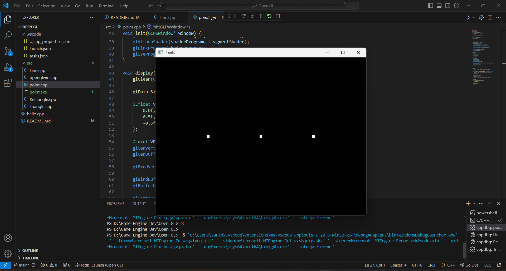
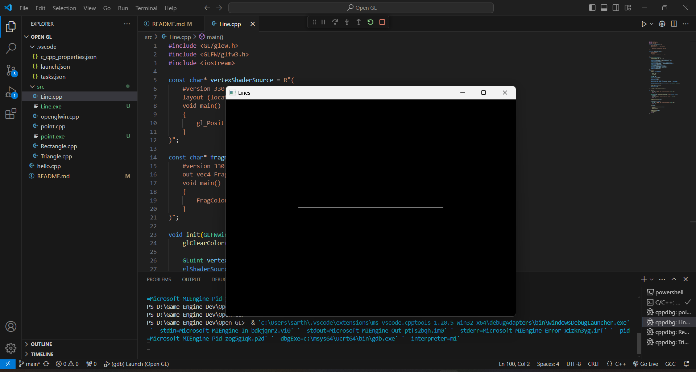
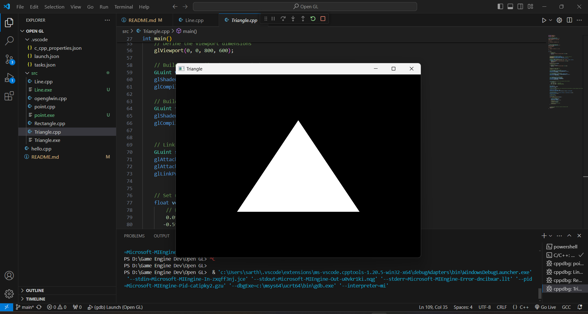
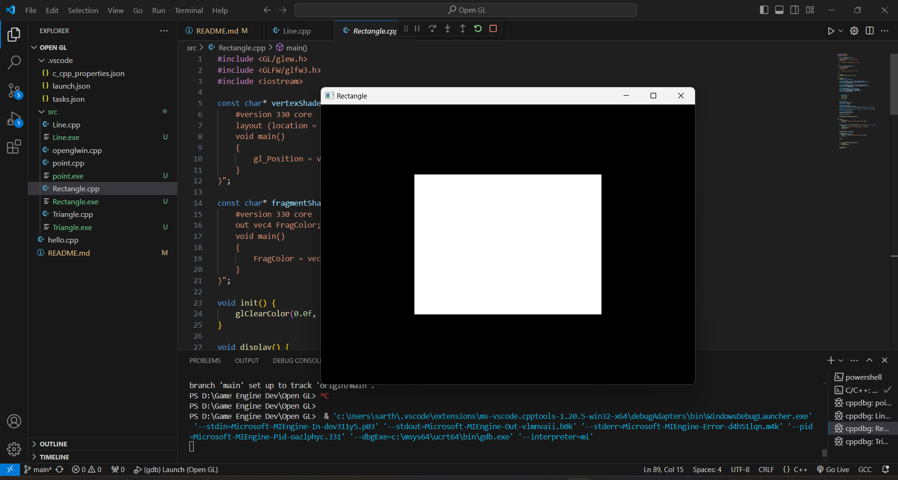

# Basic Shapes using OpenGL

This repository contains implementations of basic shapes using OpenGL.

## Description

This project showcases the rendering of basic shapes using OpenGL. It includes examples of points, lines, triangles, and rectangles created with modern OpenGL techniques.

## Preview

- **Points using OpenGL**
  

- **Line Using OpenGL**
  

- **Triangle using OpenGL**
  

- **Rectangle Using OpenGL**
  

## Libraries Used

The project utilizes the following libraries:

- **Glew 2.1.0**
- **GLFW 3.4**

## Getting Started

To run the code and view the basic shapes rendered using OpenGL, follow these steps:

1. Clone the repository.
2. Compile and run the code using an OpenGL-compatible compiler.
3. Explore the different shapes and their implementations.